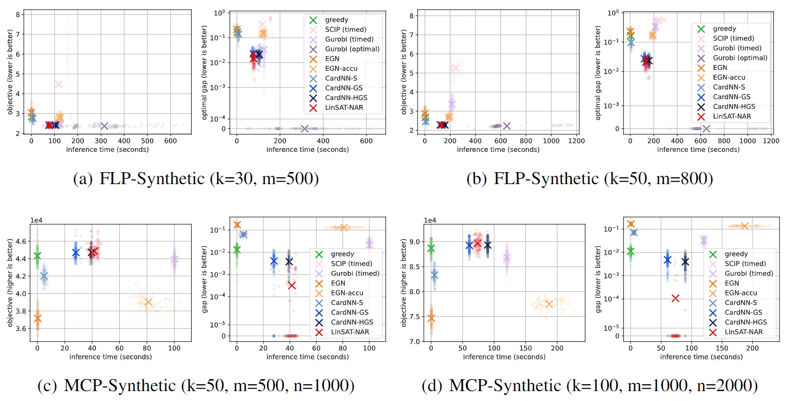

# Non-AutoRegressive-CO-Solver
This is the implementation of our non-autoregressive combinatorial optimization solvers that
solves combinatorial optimization problems with the positive linear constraint:
$$\min_\mathbf{x} J(\mathbf{w},\mathbf{x}), \qquad s.t. \mathbf{A}\mathbf{x} \leq \mathbf{b}, \mathbf{C}\mathbf{x} \geq \mathbf{d}, \mathbf{E}\mathbf{x} = \mathbf{f}, \qquad \text{where} \ \mathbf{A},\mathbf{b},\mathbf{C},\mathbf{d},\mathbf{E},\mathbf{f}\geq 0, \ \mathbf{x}\in[0, 1]^l.$$

This repository covers the following papers:

* "Towards One-shot Neural Combinatorial Solvers: Theoretical and Empirical Notes on the Cardinality-Constrained Case". 
  ICLR 2023. [[paper]](https://openreview.net/pdf?id=h21yJhdzbwz)
* "Learning to Solve Combinatorial Optimization under Positive Linear Constraints via Non-Autoregressive Neural Networks."
  _Accepted by SCIENTIA SINICA Informationis_. [[paper]](http://engine.scichina.com/doi/10.1360/SSI-2023-0269) [[in English]](https://arxiv.org/abs/2409.04495)

This work is contributed by [ThinkLab@SJTU](http://thinklab.sjtu.edu.cn) and [JD Explore Academy](https://corporate.jd.com/).

This repository offers neural network solvers, datasets, training and evaluation protocols
for three combinatorial optimization problems: 
* Facility Location Problem (FLP), on synthetic data and real-world Starbucks locations;
* Max Covering Problem (MCP), on synthetic data and real-world Twitch datasets;
* Portfolio Optimization (PortOpt), on real-world stock prices in 2021.

## A Brief Introduction of the Technical Side

Our ultimate goal is building _non-autoregressive neural combinatorial solvers_:
a neural network whose input is the parameters of a combinatorial optimization (CO) problem, 
and whose output is the solution (i.e. the decision variables). The neural network is designed 
with a non-autoregressive structure (i.e. outputs the solution in one-shot), instead of a tedious
multi-step autoregressive manner. We believe such non-autoregressive neural solvers have the 
following advantages over traditional solvers:
* Higher efficiency (neural solvers on GPU vs traditional solvers on CPU)
* Enabling joint predict-and-optimize paradigms (differentiable neural solvers vs usually 
  non-differentiable traditional solvers)

Towards the ultimate goal, we identify the following technical challenges: the output of neural 
networks is usually unconstrained, yet the solutions to combinatorial optimization usually have
complicated constraints. Besides, the discrete nature of combinatorial constraints conflicts 
with the continuous nature of neural networks. To resolve these issues, we champion 
the following methodology: 


The technical highlights are:
* Softly enforcing constraints to neural networks by a differentiable layer ([LinSAT Layer](https://github.com/Thinklab-SJTU/LinSATNet)
  could encode all positive linear constraints to neural networks);
* Using Gumbel trick to control the constraint violation (theoretical results were derived for the 
  cardinality-constrained case in ICLR'23 paper);
* Estimating the objective score end-to-end and train the neural network solver by an unsupervised loss;
* Turning the training framework into a gradient-based search framework in testing. See the following plot


### Theoretical results

One major challenge in the above pipeline is handling discrete constraints in an end-to-end
neural network, and we tried to offer some theoretical insights in that. However, the
theoretical characterization for all CO problems seems too challenging. Our ICLR'23 paper 
focused on developing theoretical results for the special case of cardinality-constrained
CO, and did a systematic study of with/without constraint encoding layers and with/without
the Gumbel trick. We are not diving too deep into the theoretical results, and here 
summarizes our main conclusion: 

> A tighter **constraint violation** leads to better performance for non-autoregressive neural 
> combinatorial solvers.

We believe such theoretical insights could further generalize to other CO problems beyond 
cardinality constraints.

In this paper, we compare three ways of handling cardinality constraints, theoretically:

* **Erdos Goes Neural** [(Karalias & Loukas, NeurIPS'20)](https://proceedings.neurips.cc/paper_files/paper/2020/file/49f85a9ed090b20c8bed85a5923c669f-Paper.pdf)
  puts constraint violation as a penalty term in the loss. Theoretically, the neural net's output
  can be arbitrary thus the constraint violation is unbonded.
* **SOFT-TopK** [(Xie et al., NeurIPS'20)](https://proceedings.neurips.cc/paper_files/paper/2020/file/ec24a54d62ce57ba93a531b460fa8d18-Paper.pdf)
  is equivalent to LinSAT _without_ Gumbel trick.
  It uses Sinkhorn to enforce cardinality constraint, which is equivalent to a TopK selection. 
  SOFT-TopK offers an upper-bound of constraint violation, yet the bound can diverge in the wost
  case (when k-th and (k+1)-th elements are equal).
* **Gumbel-Sinkhorn-TopK** (this paper) is equivalent to our methodology with LinSAT and Gumbel trick.
  It further addresses the diverging issue in SOFT-TopK. 
  Specifically, the constraint violation can be arbitrarily controlled, and its theoretical 
  upper bound is tighter than SOFT-TopK by introducing the Gumbel trick.
  
Please see the main paper for the math details.
Our experiment shows consistent result with the theoretical study: empirically, we have Erdos
Goes Neural (EGN) < SOFT-TopK (CardNN-S) < Gumbel-Sinkhorn-TopK (CardNN-GS). Experiments are 
conducted on both synthetic problems (in line with most neural CO solver papers), and transfer
learning from synthetic problems to real-world instances. 

## Experiment on Pure CO Problems

Pure CO problem means the problem parameters are known at the decision-making time. The 
neural solver should learn to optimize the objective score.

In experiments, considering both efficiency and objective score, our neural solvers can be 
_comparative to state-of-the-art traditional solvers (Gurobi and SCIP), and sometimes can even
surpass_.

### Facility Location Problem (FLP)

Given m locations, we want to extend k facilities such that the goods can be stored at the
nearest facility and delivered more efficiently. Another scenario may be a city with m 
communities, and we want to build k facilities (like battery swapping stations for e-vehicles)
for all residents.

The objective of FLP is to minimize the sum of the distances between each location and its 
nearest facility. See the paper for the math form.

### Max Covering Problem (MCP)

Given m sets and n objects, each set may cover any number of objects and each object is
associated with a value. MCP aims to find k sets (k ≪ m) such that the covered objects have 
the maximum sum of values. This problem reflects real-world scenarios such as discovering 
influential seed users in social networks.

See the paper for the math form.

### Results

Since there lacks large-scale real-world benchmark for FLP and MCP, we follow most neural CO
papers and test our solvers on synthetic data. The synthetic results are shown as follows. 
Our neural solvers are the blue ones.



We also consider a transfer learning setting with real-world data: neural networks are firstly 
learned with synthetic data, and then tested on real-world datasets. The real-world datasets 
are collected from the [Starbucks locations](https://www.kaggle.com/datasets/kukuroo3/starbucks-locations-worldwide-2021-version)
in London, New York, Shanghai, Seoul with 166-569 stores, and the 
[social network collected from Twitch](https://snap.stanford.edu/data/twitch-social-networks.html).
Our neural solvers surpasses Gurobi & SCIP on FLP. On MCP, our neural solvers are inferior, 
while it is worth noting that our Homotopy version **CardNN-HGS** finds all optimal solutions,
which is hard to achieve for most previous neural solvers.


## Experiment on Predictive CO Problems

Predictive CO problem means the problem parameters are unknown at the decision-making time.
We consider the portfolio optimization problem as an example: when making an investment, we 
cannot know the returns/risks of assets in the future. The only feasible way is predicting 
the future returns/risks, while such prediction always contains errors. If the optimizer is 
unaware of such prediction error, even the optimal solution does not reflect the optimal 
decision in the future, and it is very likely that the optimizer is misled by the prediction 
error.

The above challenge give rise to the recent research topic of joint "predict and optimize", 
and here we show that our neural solver also owns the flexibility to handle predictive CO by 
jointly learning a neural predictor and a neural solver end-to-end.

### Cardinality-constrained Portfolio Optimization

Cardinality constrained portfolio optimization considers a practical scenario where a 
portfolio must contain no more than k assets. Restricting the number of assets in a portfolio 
can reduce operational costs. A good portfolio should have a high return (measured by mean 
vector µ) and low risk (measured by covariance matrix Σ).

In this paper, we refer to maximizing the Nobel-prize-winning Sharpe ratio (see the 
paper for the math form). An LSTM is built as the predictor, followed by fully-connected 
layers as the neural solver.

### Results

We test on the real prices of S&P 500 assets in 2021. The joint predict-and-optimize method 
based on our CardNN-GS outperforms others with higher returns and lower risks.


Visualization also shows that the portfolio built by CardNN-GS is closer to the efficient 
frontier. And note that reaching the efficient frontier is nearly impossible in practice
because we do not know the real returns/risks at the decision-making time.


## Get Started

To run the code, first install ``torch`` and ``torch_geometric`` according to the official 
docs ([[PyTorch]](https://pytorch.org/get-started/locally/), [[Geometric]](https://pytorch-geometric.readthedocs.io/en/latest/install/installation.html)).
The versions we used are ``torch==1.6.0`` and ``torch-geometric==1.6.3``, and we think any 
newer versions will work too. If you face any issues during installation, there are many 
online resources available.

Then install the following Python packages:

```
pip install ortools easydict matplotlib yfinance pandas cvxpylayers xlwt pyyaml gurobipy
```

## Run the Experiments

Follow the next steps and you shall reproduce the main results in our paper.

**Note:** If you are seeing results way inferior to our paper, it is probably a reason
of random seeds. Please delete the model weights and train the model again.

### Facility Location Problem (FLP)

On synthetic data, 500 locations.
```bash
python facility_location_experiment.py --cfg cfg/facility_location_rand500.yaml
```

On synthetic data, 800 locations.
```bash
python facility_location_experiment.py --cfg cfg/facility_location_rand800.yaml
```

On real-world data (Starbucks), distance measured by Euclidean distance (or more precisely, Euclidean squared distance https://github.com/Thinklab-SJTU/One-Shot-Cardinality-NN-Solver/issues/8). 
```bash
python facility_location_experiment.py --cfg cfg/facility_location_starbucks_euclidean.yaml
```

On real-world data (Starbucks), distance measured by Manhattan distance.
```bash
python facility_location_experiment.py --cfg cfg/facility_location_starbucks_manhattan.yaml
```

### Max Covering Problem (MCP)

On synthetic data, 500 sets and 1000 items.
```bash
python max_covering_experiment.py --cfg cfg/max_cover_rand500.yaml
```

On synthetic data, 1000 sets and 2000 items.
```bash
python max_covering_experiment.py --cfg cfg/max_cover_rand1000.yaml
```

On real-world data (Twitch social network).
```bash
python max_covering_experiment.py --cfg cfg/max_cover_twitch.yaml
```

### Portfolio Optimization

Note that portfolio optimization experiment does not offer a configuration system. Some hyperparameters 
are coded at the beginning of ``portfolio_opt_experiment.py``.

Training:

```bash
python portfolio_opt_experiment.py --train --method predict-and-opt
```
``--method`` can be selected from ``predict-and-opt`` (LSTM+our CardNN-GS), ``predict-then-opt``
(LSTM+Gurobi), ``history-opt``. You need to install ``gurobipy`` and have a valid license to run 
``predict-then-opt``.

After training, load a checkpoint (at 55-th epoch here) and run testing:

```bash
python portfolio_opt_experiment.py --start_epoch 55 --method predict-and-opt
```

## Citation
If you find our paper/code useful in your research, please cite

```
@inproceedings{wang2023cardinality,
    title={Towards One-shot Neural Combinatorial Solvers: Theoretical and Empirical Notes on the Cardinality-Constrained Case}, 
    author={Runzhong Wang and Li Shen and Yiting Chen and Xiaokang Yang and Junchi Yan},
    year={2023},
    booktitle={ICLR}
}

@article{wang2024,
  author = "Runzhong Wang and Yang Li and Junchi Yan and Xiaokang Yang",
  title = "Learning to Solve Combinatorial Optimization under Positive Linear Constraints via Non-Autoregressive Neural Networks",
  journal = "SCIENTIA SINICA Informationis",
  year = "2024",
  url = "http://www.sciengine.com/publisher/Science China Press/journal/SCIENTIA SINICA Informationis///10.1360/SSI-2023-0269,
  doi = "https://doi.org/10.1360/SSI-2023-0269"
}
```
